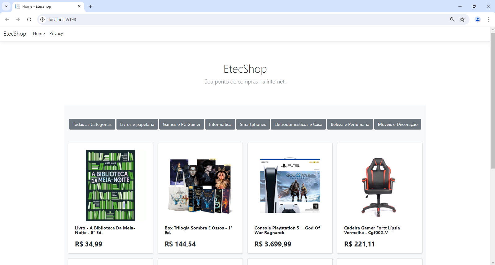
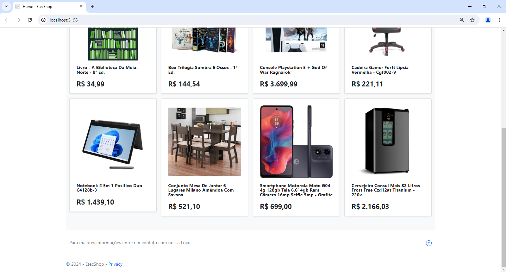
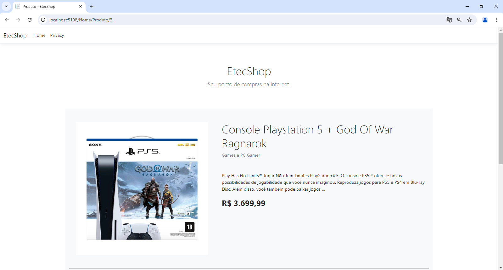
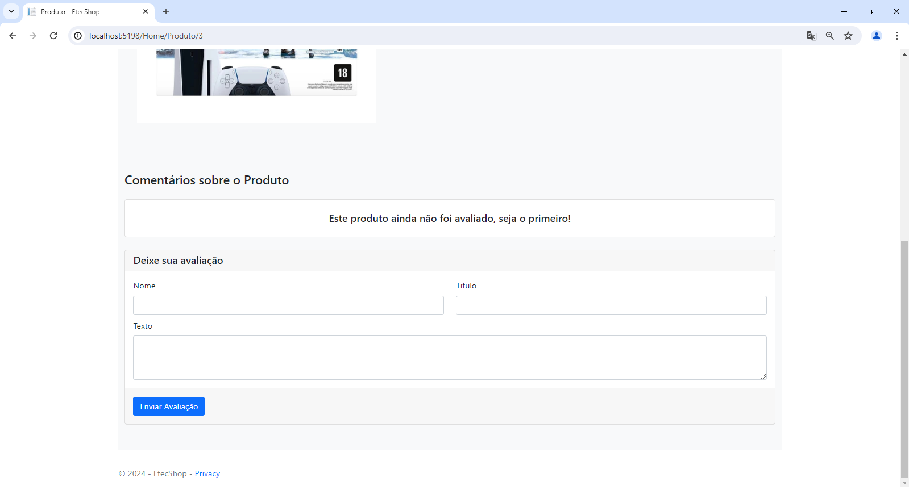

<h1 align="center">
  EtecShop
</h1>

  
  
  
  

## 💻 Projeto:

Projeto de desenvolvimento de aplicação Web com .Net MVC C# tendo como objetivo simular um e-commerce simples.

## 🚀 Tecnologias utilizadas:

- [x] HTML;
- [x] CSS;
- [x] C#;
- [x] JavaScript.
